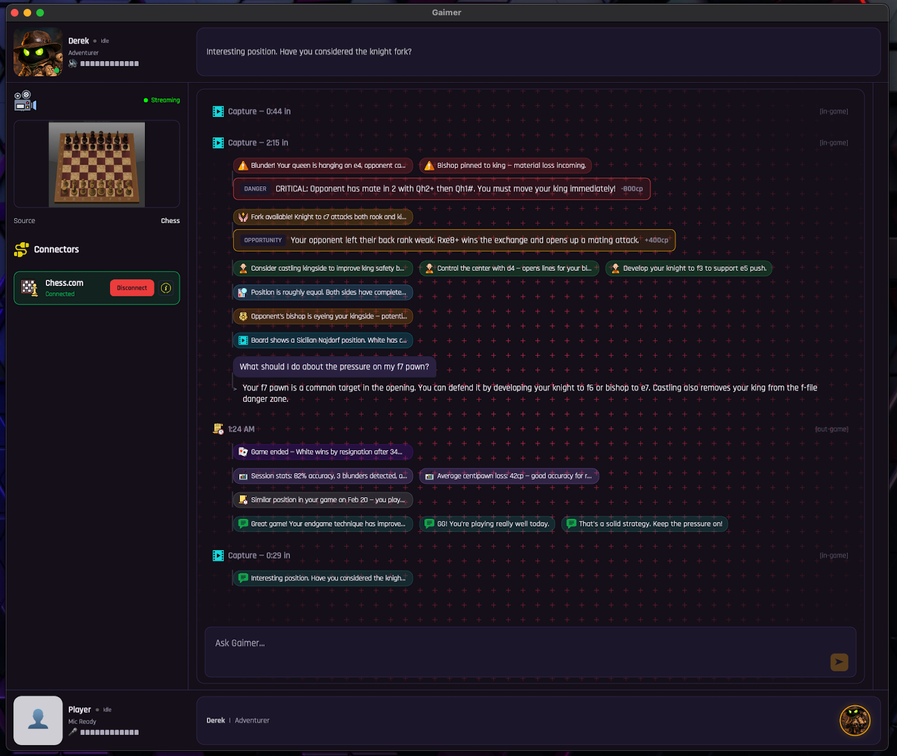
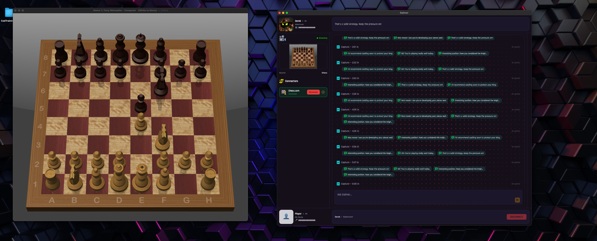

# Game Ghost App (Desktop)

Game Ghost is a .NET MAUI desktop application extracted from the Gaimer implementation and rebranded for independent experimentation.

## Current Status

- Product name and app identity: `Game Ghost`
- Bundle identifier: `com.5dof.gameghost`
- Theme direction: Rich Black + Pale Azure + Yellow contrast
- Primary desktop validation target: macOS Mac Catalyst

## Repository Layout

- `GameGhost.sln`
- `src/WitnessDesktop/WitnessDesktop/` (main MAUI app project)
- `src/WitnessDesktop/NativeHelpers/` (native capture/overlay helpers)

## Build (Mac Catalyst)

```bash
dotnet build src/WitnessDesktop/WitnessDesktop/WitnessDesktop.csproj -f net8.0-maccatalyst -p:EnableCodeSigning=false
```

## Preview




## Gallery

Add more screenshots to `docs/images/` and reference them here:

```md


```

## Notes

- Internal namespaces and some project paths still use `WitnessDesktop` for stability.
- Native helper framework identifiers still use `Gaimer*` names to preserve runtime interop compatibility.
