# App Flow Charts

**Project:** Gaimer / Witness Desktop  
**Branch context:** `post-mini-dev`  
**Companion doc:** [APP_FLOW_DESIGN.md](/Users/tonynlemadim/Documents/5DOF%20Projects/gaimerV2/WITNESS/gaimer_spec_docs/APP_FLOW_DESIGN.md)

This file is the quick visual version of the current app flow.

## 1. End-to-End User Flow

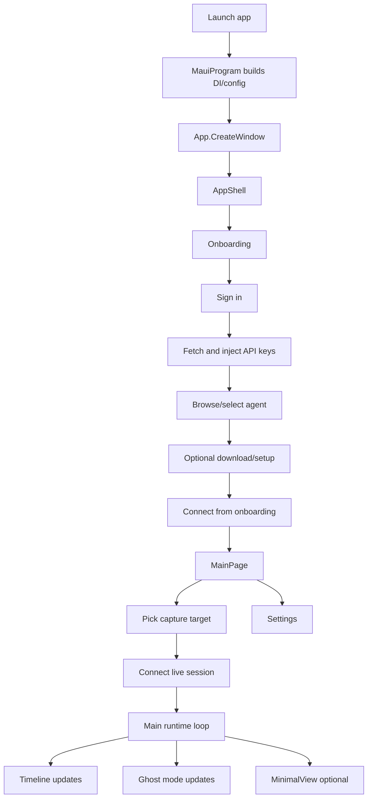

## 2. Boot and Composition Flow

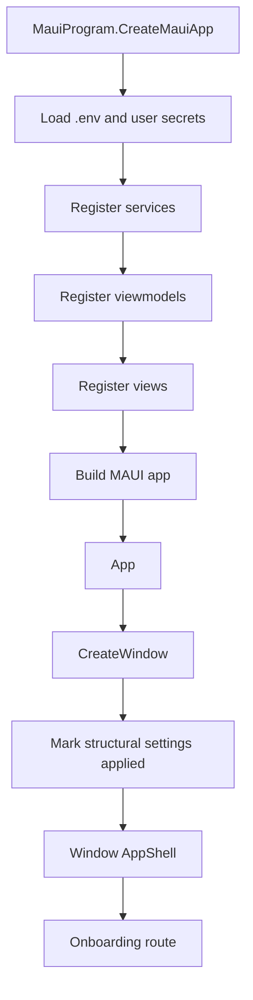

## 3. Provider Selection Flow

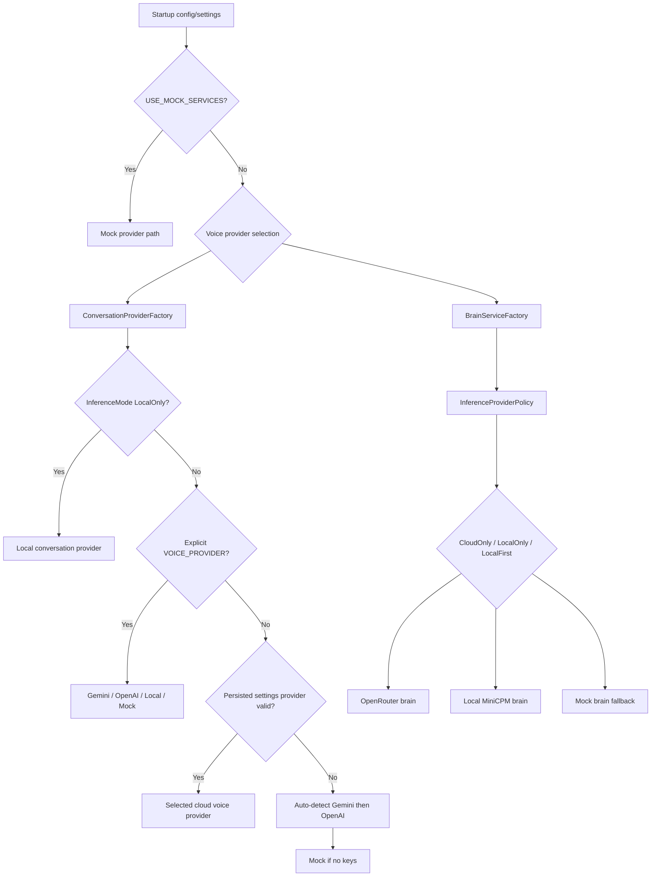

## 4. Onboarding State Flow

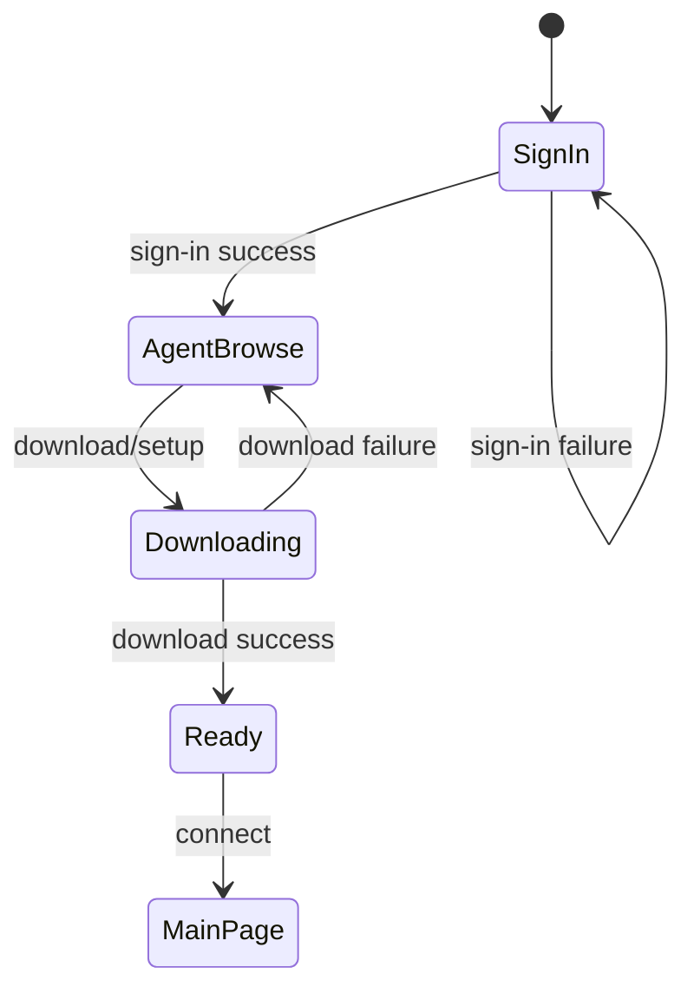

## 5. Main Session Flow

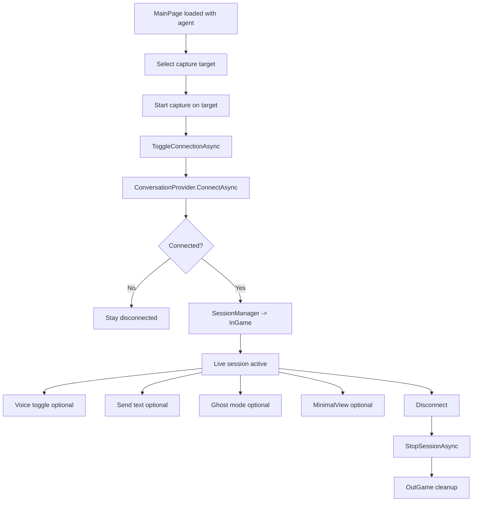

## 6. Capture to Brain Flow

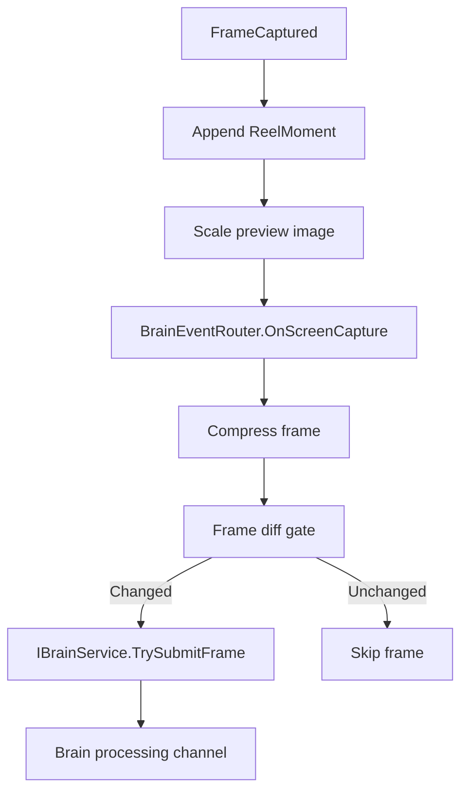

## 7. Brain and Router Flow

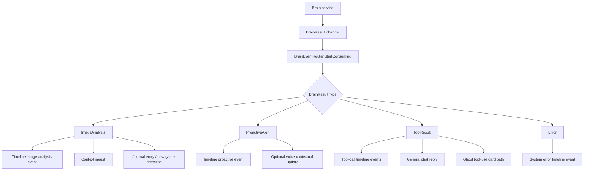

## 8. Chat Flow

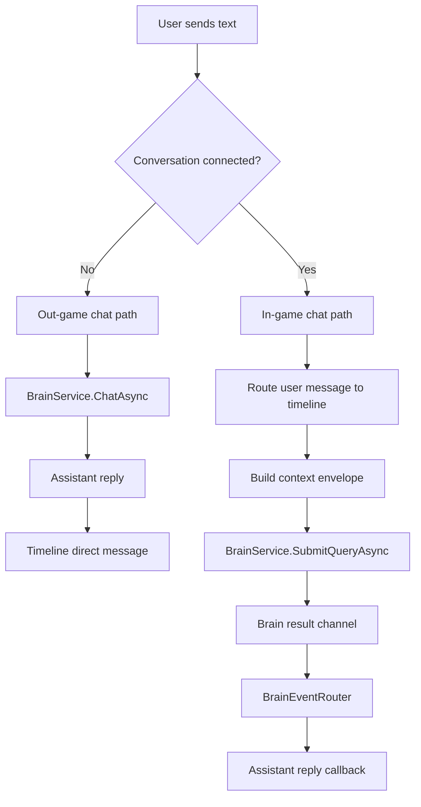

## 9. Timeline Presentation Flow

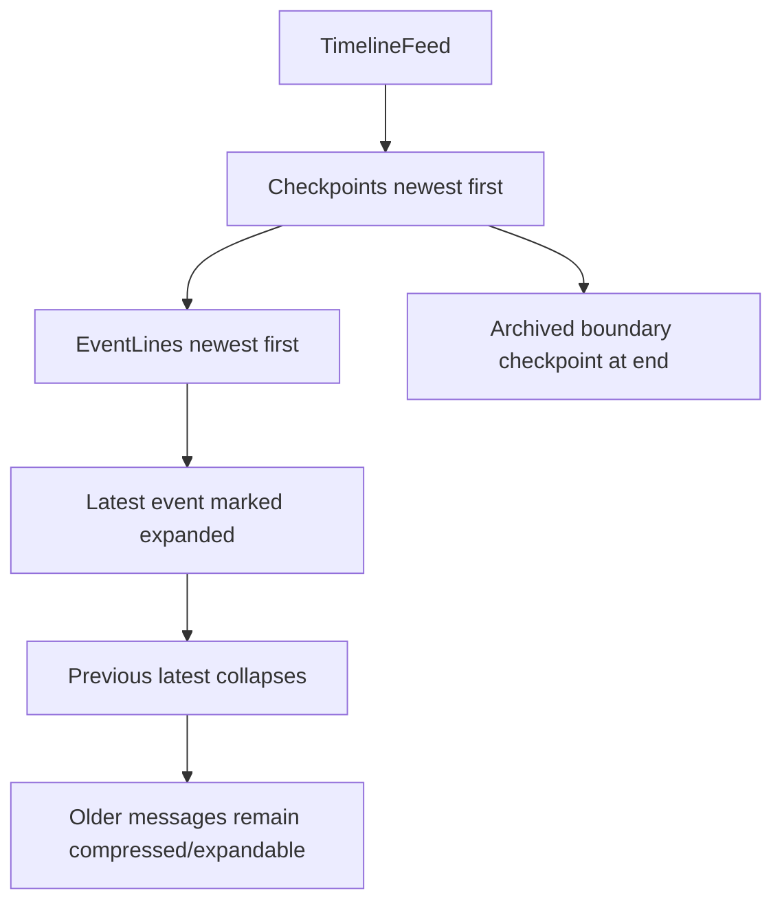

## 10. Ghost Mode Flow

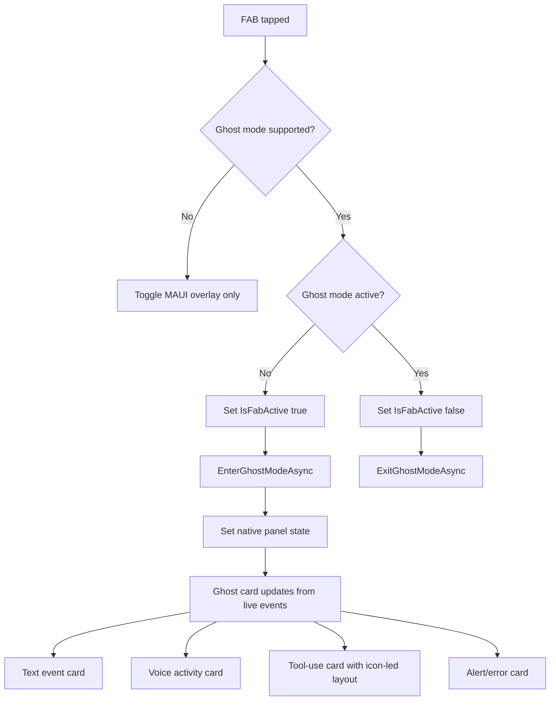

## 11. Navigation Flow

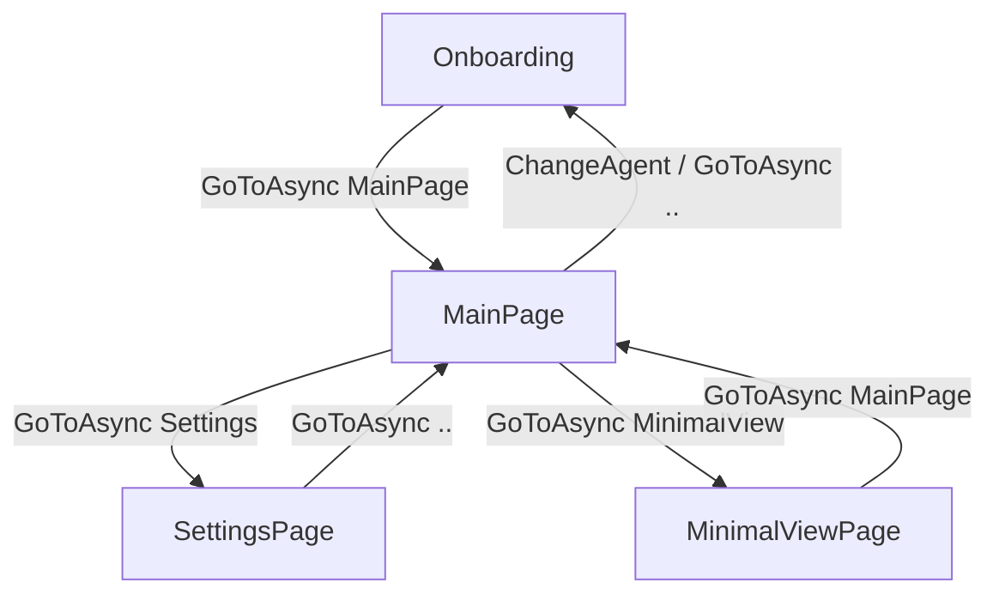

## 12. Current Verification Gate

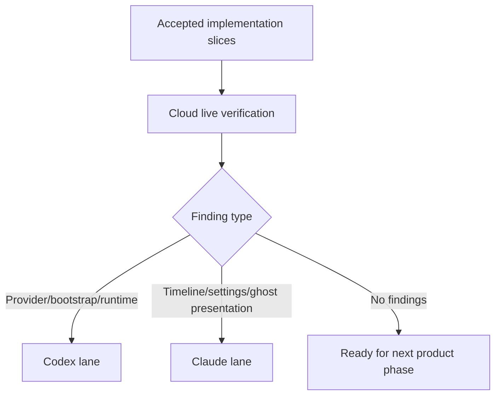

