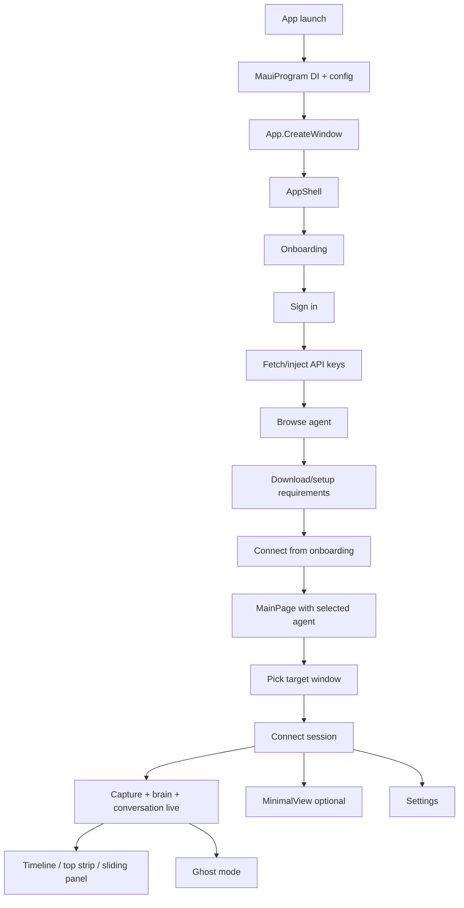

# App Flow Design

**Project:** Gaimer / Witness Desktop  
**Branch context:** `post-mini-dev`  
**Intent:** Describe the current app flow from the codebase as it exists now, not from older roadmap assumptions.

## 1. High-Level Summary

Gaimer is a .NET MAUI desktop app with a cloud-first runtime on this branch.

At a high level, the app does this:
- boots MAUI and wires services in `MauiProgram`
- opens `AppShell`, which starts at onboarding
- signs the user in and injects API keys
- lets the user choose an agent and proceed into the main dashboard
- connects voice + brain + capture services around a selected game window
- routes capture and chat events into a shared timeline, top strip, sliding panel, and ghost-mode surface
- keeps the latest timeline item expanded while older items compress
- uses ghost mode as an alternate live surface over the game window

## 2. Primary User Flow

## 3. Boot and Composition Flow

### 3.1 App startup

Runtime entry is assembled in [MauiProgram.cs](/Users/tonynlemadim/Documents/5DOF%20Projects/gaimerV2/src/WitnessDesktop/WitnessDesktop/MauiProgram.cs).

Important startup behavior:
- loads `.env` when available
- loads user secrets when available
- tees logs to `/tmp/gaimer-debug.log`
- registers all major services in DI
- builds MAUI app and opens [App.xaml.cs](/Users/tonynlemadim/Documents/5DOF%20Projects/gaimerV2/src/WitnessDesktop/WitnessDesktop/App.xaml.cs)

### 3.2 Window creation

[App.xaml.cs](/Users/tonynlemadim/Documents/5DOF%20Projects/gaimerV2/src/WitnessDesktop/WitnessDesktop/App.xaml.cs) does the following:
- logs lifecycle and crash hooks
- marks current structural settings as the applied bootstrap state
- creates a `Window(new AppShell())`
- sets initial desktop sizing constraints

This is also where structural settings become important:
- `InferenceMode` and `VoiceProvider` are tracked as bootstrap-level settings
- changing them later may require full app rebootstrap rather than a shallow reconnect

### 3.3 Shell routing

[AppShell.xaml](/Users/tonynlemadim/Documents/5DOF%20Projects/gaimerV2/src/WitnessDesktop/WitnessDesktop/AppShell.xaml) starts with `Onboarding`.

[AppShell.xaml.cs](/Users/tonynlemadim/Documents/5DOF%20Projects/gaimerV2/src/WitnessDesktop/WitnessDesktop/AppShell.xaml.cs) registers:
- `MainPage`
- `MinimalView`
- `Settings`
- `Unauthorized`
- `AgentSelection`
- `Error`

Current production entry flow is:
- `Onboarding` first
- `MainPage` after onboarding connect
- optional `MinimalView` while connected

## 4. Service Composition Flow

### 4.1 Core services

`MauiProgram.RegisterServices(...)` wires the main runtime graph:
- settings and auth
- telemetry
- audio service
- window capture service
- ghost mode service
- timeline feed
- session manager
- brain context service
- visual reel service
- frame diff service
- stockfish service
- journal service

### 4.2 Voice provider selection

[ConversationProviderFactory.cs](/Users/tonynlemadim/Documents/5DOF%20Projects/gaimerV2/src/WitnessDesktop/WitnessDesktop/Services/Conversation/ConversationProviderFactory.cs) selects the conversation provider.

Selection order:
1. `InferenceMode.LocalOnly` with local client
2. explicit `VOICE_PROVIDER`
3. `USE_MOCK_SERVICES=true`
4. persisted settings provider if valid key exists
5. Gemini API key auto-detect
6. OpenAI API key auto-detect
7. mock provider fallback

Current branch intent is cloud-first:
- `CloudOnly` is the intended live path
- local modes are not the active product path here

### 4.3 Brain provider selection

[BrainServiceFactory.cs](/Users/tonynlemadim/Documents/5DOF%20Projects/gaimerV2/src/WitnessDesktop/WitnessDesktop/Services/Brain/BrainServiceFactory.cs) selects the brain path.

It uses:
- [InferenceProviderPolicy.cs](/Users/tonynlemadim/Documents/5DOF%20Projects/gaimerV2/src/WitnessDesktop/WitnessDesktop/Services/InferenceProviderPolicy.cs)
- current settings
- local runtime health
- whether cloud brain is available

On this branch, the expected live path is:
- cloud brain via `OpenRouterBrainService`

Fallbacks still exist:
- local MiniCPM brain
- mock brain

## 5. Onboarding Flow

### 5.1 State machine

[OnboardingViewModel.cs](/Users/tonynlemadim/Documents/5DOF%20Projects/gaimerV2/src/WitnessDesktop/WitnessDesktop/ViewModels/OnboardingViewModel.cs) is a small state machine:
- `SignIn`
- `AgentBrowse`
- `Downloading`
- `Ready`

### 5.2 Sign-in

`SignInAsync()`:
- validates email and username
- calls `IAuthService.SignInWithEmailAsync(...)`
- if authorized, fetches API keys
- injects `GEMINI_APIKEY`, `OPENAI_APIKEY`, `OPENROUTER_APIKEY` into environment
- advances to `AgentBrowse`

### 5.3 Agent browse and download

Onboarding then:
- cycles through `Agents.All`
- shows available vs coming-soon agents
- optionally downloads and starts Stockfish

### 5.4 Connect from onboarding

`ConnectAsync()`:
- sets agent voice gender into settings
- attaches current username to the chosen agent
- then navigates into the main experience

The onboarding page code-behind in [OnboardingPage.xaml.cs](/Users/tonynlemadim/Documents/5DOF%20Projects/gaimerV2/src/WitnessDesktop/WitnessDesktop/Views/OnboardingPage.xaml.cs) handles the animated connect button flip before firing the command.

## 6. Main Dashboard Flow

The main operational surface is driven by [MainViewModel.cs](/Users/tonynlemadim/Documents/5DOF%20Projects/gaimerV2/src/WitnessDesktop/WitnessDesktop/ViewModels/MainViewModel.cs) and rendered by [MainPage.xaml](/Users/tonynlemadim/Documents/5DOF%20Projects/gaimerV2/src/WitnessDesktop/WitnessDesktop/MainPage.xaml).

Main user actions:
- select or change capture target
- connect / disconnect
- send text chat
- open settings
- enter ghost mode
- open minimal view

Key top-level UI areas in `MainPage`:
- left sidebar with preview and connector selection
- main feed / timeline / AI surfaces
- audio and ghost controls

## 7. Session Lifecycle Flow

### 7.1 Target selection

`SelectTargetAsync(...)`:
- deselects old target
- stops old capture if needed
- marks the new target selected
- starts capture on the chosen window via `IWindowCaptureService`

### 7.2 Connect

`ToggleConnectionAsync()` is the main session gate.

When connecting:
- creates fresh session cancellation token
- calls `_conversationProvider.ConnectAsync(SelectedAgent)`
- if connected, transitions `SessionManager` to `InGame`
- stores session start time
- leaves voice chat off until the explicit voice toggle is enabled

When disconnecting:
- disconnects conversation provider
- calls `StopSessionAsync()`
- exits minimal view if needed

### 7.3 Stop session

`StopSessionAsync()` does the heavy cleanup:
- cancels brain work
- cancels session-scoped operations
- transitions session back to `OutGame`
- stops recording and playback
- stops capture
- stops Stockfish if running
- clears selected target
- clears FAB / ghost state
- clears preview, AI display, panel content, and chat messages

## 8. Capture-to-Brain Flow

The capture pipeline is subscribed in `MainViewModel` via `_captureService.FrameCaptured`.

Actual sequence:
1. append a `ReelMoment` to the visual reel
2. scale frame for preview and publish `OnScreenCapture(...)` to the router
3. compress frame for analysis
4. run frame diff gating
5. submit changed frame to brain via `TrySubmitFrame(...)`

Important design rule in code:
- raw images go to the brain path
- voice does not receive raw images
- brain output is later routed to voice as text/context

## 9. Brain Processing Flow

[OpenRouterBrainService.cs](/Users/tonynlemadim/Documents/5DOF%20Projects/gaimerV2/src/WitnessDesktop/WitnessDesktop/Services/Brain/OpenRouterBrainService.cs) is the main cloud brain implementation.

Key behavior:
- uses a channel-based frame slot with drop-oldest semantics
- processes visual frames sequentially
- builds system and user prompts from session, context, and journal state
- can invoke tools through `ToolExecutor`
- emits `BrainResult` objects to a channel

The brain result types then feed the router:
- image analysis
- proactive alerts
- tool results
- errors

## 10. Brain Event Routing Flow

[BrainEventRouter.cs](/Users/tonynlemadim/Documents/5DOF%20Projects/gaimerV2/src/WitnessDesktop/WitnessDesktop/Services/BrainEventRouter.cs) is the translation layer between backend outputs and presentation/runtime surfaces.

It routes events into:
- timeline
- top strip text
- voice contextual updates
- game journal
- L1 brain context memory
- ghost-mode tool-card notifications
- assistant chat reply callback

Important inputs:
- `OnScreenCapture(...)`
- `OnBrainHint(...)`
- `OnImageAnalysis(...)`
- `OnToolCall(...)`
- `OnGeneralChat(...)`
- `OnError(...)`
- `StartConsuming(...)` for `BrainResult` channel output

### 10.1 Tool-call flow

Tool calls now have first-class visibility:
- backend carries `ToolCallInfo`
- router emits timeline `ToolCall` events
- `MainViewModel` listens for `ToolCallReceived`
- ghost mode can show tool-use with icon-led presentation

### 10.2 Journal and new-game detection

For image-analysis results, the router can:
- parse structured analysis
- extract FEN
- append journal entries
- detect a fresh chess game
- clear journal, flush context, and reset diff hash on new game detection

## 11. Timeline Flow

[TimelineFeed.cs](/Users/tonynlemadim/Documents/5DOF%20Projects/gaimerV2/src/WitnessDesktop/WitnessDesktop/Services/TimelineFeed.cs) stores the live feed.

Structure:
- `TimelineCheckpoint`
- each checkpoint has `EventLines`
- each line contains `TimelineEvent` items of the same output type

Important behavior:
- new checkpoints insert at index `0`
- new event lines insert at index `0`
- newest event becomes the expanded latest item
- previous latest collapses
- older messages can remain as compressed tokens
- the `Archived` marker is now a dedicated checkpoint appended at the end of the feed

This gives the feed a newest-first top-anchored behavior rather than a traditional bottom-anchored chat scroll.

## 12. Chat Flow

### 12.1 Out-of-game chat

If the conversation provider is not connected, `SendTextMessageAsync()`:
- inserts the user message
- routes it to the timeline
- calls `_brainService.ChatAsync(...)`
- inserts assistant reply
- routes assistant reply to the timeline

### 12.2 In-game chat

If connected, `SendTextMessageAsync()`:
- inserts and routes user message immediately
- builds a context envelope through `IBrainContextService`
- submits the query to the brain service
- later receives reply through `BrainChatReplyReceived`

### 12.3 Direct provider text

`_conversationProvider.TextReceived` is handled separately:
- if it matches a pending direct chat reply, it is routed as direct-message pair
- otherwise it updates AI display content, sliding panel, timeline general chat, and ghost card if active

## 13. Ghost Mode Flow

Ghost mode is owned by `IGhostModeService`, with Mac Catalyst using the native overlay implementation.

Main interactions in `MainViewModel`:
- `ToggleFabAsync()`
- `FabTapped`
- `CardDismissed`
- `AudioToggleChanged`

Behavior:
- entering ghost mode sets visible active state immediately, then calls native enter
- exiting clears visible active state immediately, then calls native exit
- ghost mode mirrors connection and audio state
- message and tool-use cards can be shown through the same ghost card pipeline

Current accepted behavior:
- tool use should not appear as plain text commentary in ghost mode
- it reuses the same card lifecycle, but with tool-specific content presentation

## 14. Minimal View Flow

[MinimalViewPage.xaml.cs](/Users/tonynlemadim/Documents/5DOF%20Projects/gaimerV2/src/WitnessDesktop/WitnessDesktop/Views/MinimalViewPage.xaml.cs) reuses the singleton `MainViewModel`.

This means:
- no separate session state exists for minimal view
- it is just another shell route over the same live runtime state
- it auto-dismisses sliding panel content based on each panel item's `AutoDismissMs`

Window transitions are managed by `MainViewModel`:
- `NavigateToMinimalViewAsync()`
- `ExpandToMainViewAsync()`

## 15. Settings and Rebootstrap Flow

Settings are persisted through `ISettingsService`.

Structural settings are tracked by:
- [IStructuralSettingsTracker.cs](/Users/tonynlemadim/Documents/5DOF%20Projects/gaimerV2/src/WitnessDesktop/WitnessDesktop/Services/IStructuralSettingsTracker.cs)
- [StructuralSettingsTracker.cs](/Users/tonynlemadim/Documents/5DOF%20Projects/gaimerV2/src/WitnessDesktop/WitnessDesktop/Services/StructuralSettingsTracker.cs)

Current rule:
- `InferenceMode` and `VoiceProvider` are bootstrap-level settings
- if they diverge from applied startup state, shallow restart is blocked
- `MainViewModel.RestartSessionAsync()` will refuse shallow restart when rebootstrap is required

This is groundwork for a stronger future rebootstrap UX.

## 16. Error Flow

Errors can enter from:
- conversation provider
- brain service
- audio service
- capture service
- native ghost/runtime layers

Current visible error routing:
- provider errors become system messages
- system messages route into the timeline as `SystemError`
- ghost mode can surface alert cards for errors
- MAUI-level unhandled exceptions are logged through `CrashLogger`

## 17. Current Branch-Specific Notes

These points are true for `post-mini-dev` right now:
- cloud-first is the intended live path
- local-first remains present in architecture, but not as the active product path
- timeline is newest-first and now includes:
  - latest-message expansion
  - tool-call visibility
  - ghost-mode tool-use support
  - a true centered `Archived` end-of-scroll boundary
- ghost icon freedom of movement is not implemented yet and is planned as a separate native session

## 18. Practical Flow Map By Surface

### Startup surface
- `MauiProgram`
- `App`
- `AppShell`

### Acquisition surface
- `OnboardingViewModel`
- `OnboardingPage`

### Primary runtime surface
- `MainViewModel`
- `MainPage`

### Secondary runtime surface
- `MinimalViewPage`
- native ghost mode overlay

### Backend orchestration surface
- `ConversationProviderFactory`
- `BrainServiceFactory`
- `OpenRouterBrainService`
- `BrainEventRouter`
- `TimelineFeed`

## 19. Open Seams

The main open seams in the current flow are:
- cloud live verification is the next execution gate
- `Archived` currently provides the visual boundary only; retention/virtualization behavior behind it is still pending
- settings-triggered full rebootstrap UX is not complete yet
- ghost icon free movement is planned separately in native AppKit/Swift

## 20. Recommended Use Of This Document

Use this file as:
- a startup map for new sessions
- a live-testing reference
- a review aid when deciding whether a change belongs in onboarding, session flow, router flow, timeline flow, or ghost mode

It should be updated whenever one of these changes materially:
- startup/navigation entry flow
- provider selection rules
- session lifecycle
- timeline model
- ghost mode behavior
